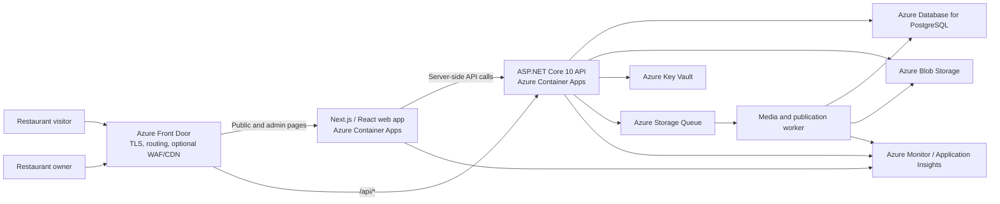
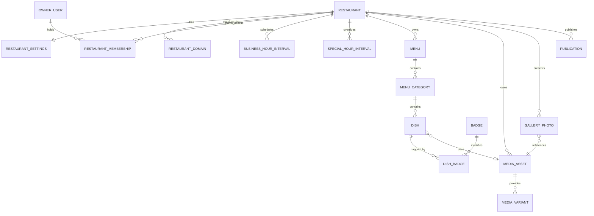

# Restaurant Website Platform — Application Architecture

**Status:** Proposed

**Version:** 0.1

**Date:** 2026-07-30

**Product source:** `requirments/Restaurant_Website_Platform_PRD_v1.0.md` and PR-1 through PR-15 task breakdowns

## 1. Purpose

This document defines the technical architecture for the Restaurant Website Platform. Product requirements remain authoritative for product behavior. This document explains how the application will be structured, built, hosted, secured, tested, and operated.

The architecture covers the complete product roadmap while prioritizing Phase 0, Phase 1, and Phase 2 delivery. It intentionally does not convert individual product tasks into implementation specifications; those specifications will be created after this architecture is approved.

## 2. Architectural goals

The platform must:

- deliver an indexable, fast public restaurant website;
- let restaurant owners manage content without developer assistance;
- support restaurant information, hours, menus, prices, availability, and galleries;
- enforce strict ownership boundaries for management operations;
- begin with one restaurant while preserving a practical path to multiple restaurants;
- keep the public menu reachable through a stable, direct, unauthenticated URL that can later be encoded into a QR code without requiring an architecture change (Phase 9);
- support accessible and responsive experiences;
- publish content consistently without exposing partial updates;
- remain straightforward for a small team to develop and operate;
- scale without requiring an early microservices architecture.

## 3. Selected technology stack

| Area | Selection | Reason |
| --- | --- | --- |
| Web application | React 19 with TypeScript | User-selected UI technology with strong component and accessibility ecosystems. |
| React framework | Next.js App Router | Server rendering and prerendering support the public-site SEO requirements; client components support the owner dashboard. |
| Backend | .NET 10 LTS with ASP.NET Core 10 | User-selected backend platform; long-term support, mature security, API, data, testing, and operations capabilities. |
| API style | REST/JSON using ASP.NET Core route groups and thin Minimal API endpoints | Keeps the HTTP layer concise while business logic remains in feature modules. |
| Database | PostgreSQL 18 | Strong relational integrity, transactions, indexing, JSON support, and a clear managed-hosting path. |
| Data access | Entity Framework Core 10 with the Npgsql provider | Migrations, transactions, typed queries, and native PostgreSQL integration. |
| Authentication | ASP.NET Core Identity with secure cookie sessions | Meets owner login/logout requirements and provides a path to password reset, MFA, and multiple owners. |
| Media storage | Azure Blob Storage | Durable storage for hero, dish, and gallery images without storing files in application containers. |
| Hosting | Azure Container Apps, Azure Database for PostgreSQL Flexible Server, and Azure Blob Storage | Managed container hosting, managed database operations, independent web/API scaling, and a consistent Azure security model. |
| Edge routing | Azure Front Door | One public origin, TLS, routing, optional WAF, caching, and future custom-domain support. |
| Secrets | Azure Key Vault with managed identities | Keeps production credentials out of source control and deployment configuration. |
| Observability | OpenTelemetry, Azure Monitor/Application Insights, and Log Analytics | Centralized logs, metrics, traces, alerts, and operational diagnostics. |
| Infrastructure as code | Bicep | Native, reviewable Azure infrastructure definitions. |
| CI/CD | GitHub Actions using Azure workload identity/OIDC | Automated verification and deployment without long-lived Azure credentials. |

Exact patch versions must be locked during Phase 0 and kept on supported release lines. Preview framework releases are not allowed in production.

## 4. Architecture style

The backend will be a **modular monolith**, not a collection of microservices.

The application will have one deployable ASP.NET Core API whose business capabilities are separated into cohesive modules. Each module owns its domain logic, data access configuration, API endpoints, validation, and tests. Modules may communicate through application interfaces and in-process domain events, but must not reach directly into another module's internal implementation.

This approach provides:

- one transactional database boundary for publication and menu updates;
- simple local development and deployment;
- clear feature ownership and test boundaries;
- a path to extract a module later if operational evidence justifies it.

Microservices, Kubernetes, a service mesh, and distributed messaging are not Phase 0 requirements.

## 5. System topology



Front Door will expose a single site origin. Browser requests to `/api/*` will be routed to ASP.NET Core, while all other application routes will be routed to Next.js. Same-origin routing avoids unnecessary CORS exposure and supports secure cookie authentication.

## 6. Application components

### 6.1 React web application

The Next.js application contains two experiences in one codebase:

- **Public website:** server-rendered or prerendered pages for restaurant information, menu, gallery, and SEO content.
- **Owner dashboard:** authenticated management pages using interactive React client components where needed.

Frontend rules:

- TypeScript strict mode is required.
- Public content required for indexing must be present in server-rendered HTML.
- Server Components are preferred for read-only page composition; Client Components are used for interactive controls.
- The web application must use a shared design-system layer for typography, spacing, colors, controls, dialogs, loading states, and errors.
- Accessibility semantics must be built into shared components rather than added independently to every page.
- Public page metadata, canonical URLs, Open Graph data, sitemap data, and later structured data are generated from restaurant content.
- The browser must not receive database entities or internal administration models.

### 6.2 ASP.NET Core API

The API is responsible for:

- business rules and validation;
- authentication and authorization;
- tenant/restaurant isolation;
- draft and publication operations;
- public and administrative data contracts;
- media-upload authorization and metadata;
- schedule and open/closed calculations;
- persistence and cache-invalidation events.

API rules:

- Use `/api/v1` as the initial versioned route prefix.
- Separate public read endpoints from authenticated administration endpoints.
- Use explicit request and response DTOs; persistence entities are never API contracts.
- Use RFC-compatible Problem Details responses for failures.
- Generate OpenAPI documentation in development and CI.
- Apply authorization at endpoint boundaries and again at domain ownership boundaries.
- Use optimistic concurrency for owner-edited resources to prevent silent overwrites.
- Use pagination for potentially unbounded administrative collections.
- Keep endpoint handlers thin; feature services own business logic and transactions.

### 6.3 Background worker

A small worker process will handle durable work that should not be tied to an HTTP request:

- image validation and derivative generation;
- cleanup of failed or abandoned uploads;
- durable publication/cache-invalidation events;
- future scheduled publication or maintenance jobs.

The worker will consume Azure Storage Queue messages. Database-backed outbox records ensure committed changes are not lost if queue delivery temporarily fails.

The worker may be introduced only when the first asynchronous workflow requires it; its contract and deployment slot are reserved in the architecture from Phase 0.

## 7. Backend module boundaries

| Module | Responsibilities | Product coverage |
| --- | --- | --- |
| Identity & Access | Owner accounts, login/logout, sessions, memberships, authorization policies | PR-8, PR-21 |
| Restaurants | Restaurant profile, contact details, address, social links, settings, domains | PR-1, PR-2, PR-9, PR-20 |
| Scheduling | Regular hours, special hours, timezone-aware status calculation | PR-2, PR-3, PR-9 |
| Menus | Menus, categories, dishes, badges, prices, ordering, visibility, availability | PR-5–7, PR-11–14 |
| Media | Upload lifecycle, image metadata, variants, validation, storage | PR-1, PR-5, PR-9, PR-12, PR-15–16 |
| Gallery | Gallery membership, captions, activation, ordering, public projection | PR-15–16 |
| Publishing | Draft state, preview, immutable publication versions, public projections, invalidation | PR-9, PR-13–14, PR-25 |
| Public Presentation | Public read models, SEO metadata, sitemap and structured-data inputs | PR-1–7, PR-10, PR-15, PR-17–19 |
| Platform Operations | Health, configuration, outbox, diagnostics, operational safeguards | PR-22–24 and cross-cutting requirements |

Module names describe ownership, not separate deployable services.

## 8. Multi-restaurant strategy

The MVP may expose one configured restaurant, but the data and authorization model will be tenant-aware from the first migration.

Rules:

- Every restaurant-owned record has a non-null `restaurant_id`.
- Uniqueness constraints include `restaurant_id` when uniqueness is restaurant-local.
- Administrative endpoints derive accessible restaurant IDs from the authenticated membership; they do not trust an arbitrary client-supplied restaurant ID.
- Public restaurant resolution is encapsulated behind a resolver. The MVP resolver may return the configured restaurant; later it can resolve a hostname, custom domain, or slug.
- Cross-restaurant authorization is covered by integration tests for every management module.
- A single PostgreSQL database and shared schema are used initially. Database-per-restaurant is not justified for the MVP.

This makes Phase 7 an expansion of routing, provisioning, and operations rather than a full data-model rewrite.

## 9. Canonical domain model

The following model is the architectural baseline. Technical specifications will define exact columns, indexes, limits, and API shapes.



Important model rules:

- `RestaurantSettings` owns timezone, locale, currency, and tax-display mode.
- Regular and special schedules support multiple intervals per day and overnight intervals.
- A menu owns ordered categories; a category owns ordered dishes.
- Availability, publication state, and deletion/archive state are separate concepts.
- Prices use fixed-precision decimal storage and an explicit currency context.
- Media assets are reusable records; blob URLs are not treated as unmanaged strings.
- Owner access is modeled through restaurant memberships so multiple owners and roles can be added without redesign.
- All mutable entities include timestamps and concurrency tokens.

## 10. Draft, preview, and publication architecture

The product documents currently contain both automatic-publication and manual-publication behavior. The architecture supports either product decision through one publication pipeline:

1. Owner edits update the normalized draft model.
2. Preview endpoints read the current draft model.
3. A publish command creates a consistent immutable public snapshot/version.
4. Public endpoints read only the published projection.
5. A durable outbox event triggers web-page and edge-cache revalidation.

If the approved product behavior is “publish on save,” the save workflow invokes the same publish command immediately. If manual publication is selected, save and publish remain separate actions. This avoids implementing two unrelated content systems.

The published projection may be stored as a versioned PostgreSQL JSON document per restaurant because public restaurant pages are read as an aggregate. Normalized tables remain the source for management, validation, and reporting. Exact snapshot structure belongs in the Publishing technical specification.

## 11. Product decisions required before feature specifications

Architecture cannot correctly choose these user-visible behaviors. They must be resolved in the product requirements before the related technical specification is approved:

1. Are owner changes automatically published or saved as drafts?
2. Are unavailable dishes hidden or displayed with an “Unavailable” indicator?
3. Are empty menu categories hidden or displayed with an empty state?
4. Is zero a valid dish price?
5. Is a dish photo required or optional?
6. Which social platforms are officially supported?
7. Does the MVP support one active menu only, or named menus such as lunch and dinner?
8. What is the exact MVP boundary within PR-1 through PR-25?

The architecture deliberately preserves options for these decisions without declaring them resolved.

## 12. Scheduling and time

All schedule calculations occur on the backend using the restaurant's IANA timezone.

The scheduling model must support:

- zero or more regular opening intervals per weekday;
- split service, such as lunch and dinner;
- intervals that end after midnight;
- date-specific special intervals;
- a fully closed override for a date;
- daylight-saving transitions;
- deterministic “Open now,” “Opens at,” and “Closes at” results.

The browser may format returned instants for display but must not independently determine authoritative open/closed status.

## 13. Media architecture

Media uploads follow a controlled lifecycle:

1. An authenticated owner requests an upload for a specific restaurant and purpose.
2. The API validates ownership, declared type, and configured limits.
3. The client receives a short-lived upload authorization for a staging container.
4. The worker validates the actual file, removes unsafe metadata, and generates required variants.
5. The asset becomes active only after processing succeeds.
6. Database references determine whether an asset is in use; cleanup is delayed and recoverable.

Public pages use responsive variants and descriptive alternative text. Hero images, dish images, thumbnails, and full gallery images share the same media service but have purpose-specific dimension and size rules defined in feature specifications.

## 14. Authentication and authorization

ASP.NET Core Identity will manage first-party owner accounts.

Security requirements:

- Passwords are hashed only through Identity's supported password hasher.
- Authentication uses `HttpOnly`, `Secure`, same-site cookies over HTTPS.
- State-changing browser requests use antiforgery protection.
- Login endpoints use rate limiting and generic failure messages.
- Session expiration, revocation, logout, and data-protection key persistence are tested.
- Owner authorization uses restaurant membership and policies, not only UI route protection.
- Secrets are stored in Key Vault in hosted environments and development secret storage locally.
- Production logs must not contain passwords, session tokens, connection strings, or uploaded file contents.
- Account provisioning, recovery, email confirmation, and MFA policy must be finalized in the PR-8 specification.

The public website remains anonymous and read-only.

## 15. API and integration conventions

- JSON uses consistent camel-case naming and ISO 8601 date/time representations.
- Public date-only values remain date-only; instants include UTC offsets.
- Validation errors identify safe field-level problems.
- `401` represents unauthenticated requests; `403` represents authenticated but unauthorized requests.
- Resource-not-found behavior must avoid cross-restaurant information leakage.
- Create operations return the created resource and stable identifier.
- Update operations support concurrency checks.
- Delete behavior distinguishes reversible archive/soft delete from permanent media cleanup.
- The API contract is generated as OpenAPI and checked for unreviewed breaking changes in CI.
- External map and social integrations are behind adapters so provider-specific details do not leak into the core domain.

## 16. SEO and public rendering

The public site will use Next.js server rendering, static generation, or incremental revalidation according to page behavior.

Requirements:

- Restaurant and menu content is present as HTML text, not only loaded after browser JavaScript.
- Each public page has a stable canonical URL and metadata.
- Robots and sitemap output reflect published content only.
- Structured restaurant and menu data can be generated from the public projection in Phase 6.
- Draft and preview pages are not indexable.
- Custom domains can resolve to the same application while producing tenant-correct canonical URLs.
- Cache invalidation is driven by successful publication events.
- The menu page's canonical URL stays constant across content/publication changes and requires no session or query state to resolve, so it can double as a future QR-code target (Phase 9, PR-26) without a URL-scheme change.

## 17. Performance and caching

The initial architecture favors correctness and measurable optimization:

- Public API responses may use ASP.NET Core output caching when the publication version is part of the cache key.
- Next.js may cache published page output and revalidate it after publication.
- Static assets and processed media receive long-lived immutable cache headers.
- Draft, preview, authentication, and administration responses are private and must not be edge-cached.
- Large administrative collections use pagination.
- Database queries must avoid per-row round trips and include indexes for restaurant, ordering, status, and publication access patterns.
- Redis or another distributed cache is not a Phase 0 dependency. It may be added when multiple instances or measured load require shared caching.

Numerical performance budgets and load profiles must be defined in the Phase 0 quality specification rather than implied by words such as “fast” or “smooth.”

## 18. Accessibility and responsive design

The design system and feature specifications must name the required accessibility standard and conformance level.

Architecture-level requirements:

- semantic HTML and native controls are preferred;
- all interactive behavior works with keyboard input;
- visible focus and focus restoration are required;
- dialogs and gallery viewers manage focus correctly;
- touch target requirements are represented in shared components;
- images require meaningful alternative text or an explicit decorative designation;
- color is never the only representation of state;
- automated accessibility checks run in CI and manual checks cover critical flows;
- responsive behavior is verified at a documented viewport matrix rather than broad device labels alone.

## 19. Repository structure

```text
/
├── src/
│   ├── web/                    # React / Next.js application
│   ├── api/                    # ASP.NET Core modular monolith
│   └── worker/                 # Async media/publication processing
├── tests/
│   ├── api-unit/
│   ├── api-integration/
│   ├── web-unit/
│   └── end-to-end/
├── infra/
│   └── bicep/                  # Azure infrastructure modules and environments
├── specifications/
│   ├── architecture.md
│   ├── phase-0/
│   ├── phase-1/
│   └── phase-2/
├── requirments/                # Existing product requirements; rename separately
├── .github/workflows/
└── README.md
```

Each product PR will have one technical specification file. Product tasks remain identifiable as sections within that file so requirements, implementation, and tests can be traced without creating dozens of disconnected documents.

## 20. Local development

Phase 0 will provide a reproducible local environment:

- supported .NET SDK and Node.js LTS versions pinned in repository files;
- PostgreSQL in Docker Compose;
- Azure Storage emulator or a documented development storage account;
- local API, worker, and web start commands;
- development secrets outside source control;
- database migration and seed commands;
- one deterministic sample restaurant with menu and schedule data;
- local email or account-provisioning substitute for authentication work;
- architecture-consistent test commands.

Cloud access must not be required for ordinary feature development or automated tests.

## 21. Testing strategy

| Layer | Tools | Purpose |
| --- | --- | --- |
| Backend unit | xUnit | Pure domain and application-service rules, including schedules and publication. |
| Backend integration | xUnit, `WebApplicationFactory`, Testcontainers PostgreSQL | HTTP pipeline, authentication, authorization, EF Core migrations, transactions, and tenant isolation. |
| Frontend unit/component | Vitest, React Testing Library | Components, validation presentation, state, and accessibility behavior. |
| Contract | Generated OpenAPI plus compatibility checks | Prevent accidental API breaking changes. |
| End-to-end | Playwright | Public browsing, owner login, management, preview/publication, and responsive critical paths. |
| Infrastructure | Bicep validation and deployment smoke tests | Detect invalid or incomplete environment definitions. |

Tests must validate acceptance behavior, not only successful execution. Security boundaries, cross-restaurant access, special-hour precedence, publication consistency, and unavailable-content behavior require adversarial cases.

## 22. CI/CD and environments

Environments:

- **Local:** developer machine with containerized dependencies.
- **Preview:** optional short-lived web/API deployment for a pull request.
- **Staging:** production-like validation environment with isolated data.
- **Production:** customer-facing environment with protected deployment controls.

GitHub Actions pipeline:

1. Restore dependencies using lockfiles.
2. Format/lint and perform static analysis.
3. Build web, API, worker, and infrastructure.
4. Run unit, integration, accessibility, and selected browser tests.
5. Build immutable container images and record provenance.
6. Validate Bicep changes.
7. Deploy automatically to staging after merge according to repository policy.
8. Run migrations as a controlled deployment step.
9. Run smoke tests and health checks.
10. Require explicit authorization for production deployment.

Production software deployment remains human-controlled unless a later delivery policy explicitly changes that rule. Restaurant content publication follows the product behavior approved for the Publishing module.

## 23. Azure deployment design

Each hosted environment uses an isolated resource group. Production contains:

- Azure Front Door profile, endpoint, custom domains, and managed TLS;
- Next.js web Container App;
- ASP.NET Core API Container App;
- worker Container App or job when asynchronous work is enabled;
- Container Apps environment;
- PostgreSQL Flexible Server and database;
- Storage account with private media, public processed media, and queue services;
- Key Vault;
- Container Registry;
- Application Insights and Log Analytics workspace;
- managed identities and least-privilege role assignments;
- budget and availability alerts.

The database is not publicly reachable in production. Services use managed identity where Azure supports it and Key Vault references otherwise. Front Door is the only intended public application entry point.

## 24. Observability and operations

All processes emit structured logs, metrics, and distributed traces using OpenTelemetry conventions.

Minimum operational signals:

- request rate, latency, and failure rate;
- authentication successes, failures, and throttling;
- database connectivity and query failures;
- publication duration and failed publication events;
- queue depth and dead-letter/failure count;
- image-processing duration and failures;
- public page rendering failures;
- container restarts and resource saturation.

The API exposes separate liveness and readiness health endpoints. Readiness includes critical dependencies needed to serve traffic. Public health details must not reveal secrets or infrastructure topology.

Production requires documented alert ownership, incident response, database restoration, media recovery, and rollback procedures. Exact availability, recovery-time, and recovery-point objectives require product/business approval before launch.

## 25. Data protection, backup, and recovery

- PostgreSQL automated backups and point-in-time recovery are enabled in production.
- Blob soft delete and versioning are enabled for customer media.
- Backup retention differs by environment and is defined in the Phase 0 operations specification.
- Restore procedures are tested before production launch and periodically afterward.
- Database migrations must include forward deployment and rollback/mitigation notes.
- Destructive customer-content operations are recoverable for a defined retention period.
- Audit records cover security-sensitive and owner content-management operations without recording secrets.

## 26. Scaling strategy

The initial production deployment uses one or a small number of replicas per web/API component. Scaling is driven by measured demand.

Growth path:

1. Scale Next.js and API replicas independently.
2. Add shared cache coordination when multiple web instances require it.
3. Scale worker consumers based on queue depth.
4. Add database read optimization, indexes, and connection pooling based on traces.
5. Introduce stronger tenant partitioning only when database size or compliance requires it.
6. Extract a module into a service only when it has a demonstrably independent scaling, reliability, or ownership need.

## 27. Phase coverage

| Product phase | Architectural support |
| --- | --- |
| Phase 1 — Website Foundation | SSR React pages, restaurant module, schedules, maps adapter, design system, SEO metadata, responsive/accessibility baseline. |
| Phase 2 — Digital Menu | Menu module, relational hierarchy, badges, public projection, media variants, price/tax context, availability policy. |
| Phase 3 — Restaurant Management | Identity, secure sessions, memberships, administration UI, draft/publication pipeline. |
| Phase 4 — Menu Management | Authorized category/dish/price/availability commands, concurrency control, audit events. |
| Phase 5 — Gallery | Media service, ordered gallery records, image viewer assets, background processing. |
| Phase 6 — Search Visibility | Server-rendered published content, canonical domains, sitemap/robots, structured-data projections. |
| Phase 7 — Multi-Restaurant | Restaurant-scoped records, memberships, host/slug resolver, custom domains, tenant-safe authorization. |
| Phase 8 — Product Polish | Problem Details, observability, performance budgets, recovery, usability, and publication guarantees. |
| Phase 9 — QR Code Menu Access (Future) | Reuses the existing stable, unauthenticated `/menu` canonical URL and public menu module; adds QR code generation/download in the owner dashboard. No new architecture required if the direct-link constraint in Section 2 is upheld. |

## 28. Phase 0 specification boundary

The Phase 0 technical specification should derive implementable tasks for:

- repository and solution scaffolding;
- local development environment;
- React/Next.js application baseline;
- ASP.NET Core API baseline;
- PostgreSQL, EF Core, and migration baseline;
- Identity and tenant-context foundations;
- shared API error and validation conventions;
- initial design-system and accessibility foundations;
- Azure infrastructure and environments;
- CI quality gates and deployment pipeline;
- health, logs, metrics, and traces;
- test infrastructure and sample data;
- developer and operational documentation.

Phase 0 must establish capabilities only. It must not implement Phase 1 or Phase 2 product features prematurely.

## 29. Architecture decisions and deferred decisions

### Accepted by this proposal

- React-based web UI.
- ASP.NET Core backend.
- PostgreSQL relational database.
- Modular monolith backend.
- Next.js rendering layer for SEO and public performance.
- Azure managed hosting.
- Same-origin web and API routing.
- Restaurant-scoped data from the first migration.
- Separate draft management and published public projection.
- Managed object storage for all images.
- Infrastructure as code and automated verification.

### Deferred to technical specifications

- Exact endpoint paths and payloads.
- Exact table columns, constraints, and indexes.
- Component-level frontend structure.
- Image sizes, formats, and upload limits.
- Numerical performance and availability targets.
- Detailed account-provisioning and recovery flow.
- Exact publication snapshot format.

### Blocked on product decisions

- Automatic versus explicit publication.
- Hidden versus labeled unavailable dishes.
- Empty-category behavior.
- Zero-price behavior.
- Required versus optional dish images.
- Supported social platforms.
- MVP roadmap cutoff.

## 30. Official platform references

- [.NET support policy](https://dotnet.microsoft.com/en-us/platform/support/policy)
- [ASP.NET Core documentation](https://learn.microsoft.com/aspnet/core/)
- [React versions](https://react.dev/versions)
- [Next.js App Router](https://nextjs.org/docs/app)
- [Next.js self-hosting guidance](https://nextjs.org/docs/app/guides/self-hosting)
- [Azure Database for PostgreSQL supported versions](https://learn.microsoft.com/azure/postgresql/configure-maintain/concepts-supported-versions)
