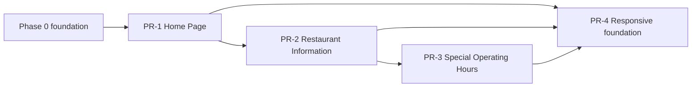

# Phase 1 — Technical Specification

**Status:** Proposed

**Version:** 0.1

**Architecture dependency:** `specifications/architecture.md`

**Product scope:** PR-1 through PR-4

## 1. Purpose

This package converts Phase 1 product requirements into implementable technical specifications for the React/Next.js web application and ASP.NET Core platform.

The package contains:

- `pr-1-home-page.md`
- `pr-2-restaurant-information.md`
- `pr-3-special-operating-hours.md`
- `pr-4-responsive-experience.md`

Product requirements remain authoritative for user-visible intent. These specifications define implementation boundaries, contracts, validation, testing, and completion evidence.

## 2. Scope normalization

The source documents contain overlaps and sequencing conflicts. Phase 1 uses the following rules:

1. The main PRD is authoritative when a detailed task breakdown conflicts with it.
2. Phase 1 delivers the anonymous public experience. Authenticated owner-management screens belong to Phase 3.
3. PR-2 owns contact information, address, coordinates, regular hours, social links, their public API, and their public presentation.
4. PR-3 owns special-hour persistence, precedence, public presentation, and schedule integration. PR-2 does not create a second special-hours model.
5. PR-3 owner CRUD endpoints and owner UI are specified for traceability but deferred until the Phase 3 authentication and management foundation exists.
6. PR-4 applies its verification to Phase 1 pages and components. It establishes standards inherited by later phases but does not create unused forms, tables, or dialogs.
7. PR-1 uses a typed server-side fixture through an abstraction. PR-2 replaces that source with the public restaurant API without rewriting presentation components.
8. The Phase 1 social-platform set follows the PRD: Instagram, Facebook, TikTok, and Google Business Profile. Adding other platforms requires a product update but not a schema redesign.

## 3. Phase 0 prerequisites

Phase 1 assumes Phase 0 has delivered:

- a buildable .NET 10 solution and ASP.NET Core API;
- a buildable React 19/Next.js TypeScript application;
- PostgreSQL, EF Core, and migration tooling;
- local containerized dependencies and sample configuration;
- shared Problem Details, validation, OpenAPI, logging, and health conventions;
- test projects and browser-test infrastructure;
- CI checks for build, lint, types, tests, and migrations;
- deployment environments and secret-management conventions.

If a prerequisite is absent, it must be completed as Phase 0 work and must not be hidden inside a Phase 1 feature PR.

## 4. Delivery order

PR-4 standards are applied continuously, but its final validation runs after PR-1 through PR-3 are integrated.

## 5. Shared technical conventions

### 5.1 Web

- Public routes use Next.js App Router.
- Public information is server-rendered; essential content must not depend on client-side JavaScript.
- TypeScript strict mode is required.
- Server Components are the default for read-only content.
- Client Components require an interaction that cannot be expressed with ordinary HTML/CSS.
- Shared components own semantic HTML, focus behavior, error presentation, and responsive states.
- CSS uses mobile-first rules, CSS custom-property design tokens, and locally scoped CSS Modules.
- Remote image hosts are allowlisted explicitly in Next.js configuration.

### 5.2 API

- Public Phase 1 endpoints are under `/api/v1/public` and allow anonymous access intentionally.
- Restaurant resolution uses the request host; local development may use a configured default restaurant.
- Minimal API endpoints are grouped by feature and return typed results.
- Endpoint handlers delegate business rules and database work to scoped application services.
- API DTOs are separate from EF Core entities.
- Failures use Problem Details; unexpected internal details are not exposed.
- OpenAPI output is generated and checked in CI.

### 5.3 Data

- PostgreSQL identifiers are UUIDs generated by the application or database consistently.
- Every restaurant-owned record includes non-null `restaurant_id`.
- Timestamps are UTC instants; restaurant-local dates and times use date/time-specific database types.
- Every migration has an integration test proving a clean database can migrate to the current version.
- EF Core entities never cross the API or web boundary directly.

### 5.4 Accessibility

- Phase 1 targets WCAG 2.2 Level AA.
- Automated checks complement but do not replace keyboard and screen-reader-oriented manual verification.
- All responsive variations of a page must satisfy the accessibility target.

### 5.5 Performance

The public Phase 1 experience targets the “good” Core Web Vitals thresholds at the 75th percentile in production:

- LCP at or below 2.5 seconds;
- INP at or below 200 milliseconds;
- CLS at or below 0.1.

Before real-user data exists, CI uses repeatable mobile lab measurements and records the baseline. A regression beyond the approved tolerance fails the performance check.

## 6. Common definition of done

Each PR is complete only when:

- every mapped product task is implemented, explicitly deferred, or rejected with recorded rationale;
- acceptance behavior has automated evidence at the appropriate test layer;
- `dotnet` build and tests pass with warnings treated according to repository policy;
- web lint, type-check, unit/component tests, and production build pass;
- database migrations apply to a clean PostgreSQL database;
- OpenAPI contains the introduced or changed endpoints;
- no secrets, credentials, or environment-specific URLs are committed;
- accessibility checks report no serious or critical issues on affected pages;
- browser tests pass at the Phase 1 viewport matrix;
- logs contain no unexpected errors during the critical path;
- documentation and traceability tables are updated.

## 7. Traceability summary

| Product PR | Source tasks | Technical specification |
| --- | ---: | --- |
| PR-1 Home Page | 10 | `pr-1-home-page.md` |
| PR-2 Restaurant Information | 12 | `pr-2-restaurant-information.md` |
| PR-3 Special Operating Hours | 7 | `pr-3-special-operating-hours.md` |
| PR-4 Responsive Experience | 12 | `pr-4-responsive-experience.md` |

## 8. References

- [Application architecture](../architecture.md)
- [WCAG 2.2](https://www.w3.org/TR/WCAG22/)
- [Core Web Vitals thresholds](https://web.dev/articles/defining-core-web-vitals-thresholds)
- [ASP.NET Core documentation](https://learn.microsoft.com/aspnet/core/)
- [Next.js App Router](https://nextjs.org/docs/app)
