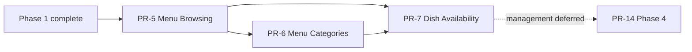

# Phase 2 — Technical Specification

**Status:** Proposed

**Version:** 0.1

**Architecture dependency:** `specifications/architecture.md`

**Product scope:** PR-5 through PR-7

## 1. Purpose

This package converts Phase 2 product requirements into implementable technical specifications for public menu browsing, category navigation, and dish availability.

- `pr-5-menu-browsing.md`
- `pr-6-menu-categories.md`
- `pr-7-dish-availability.md`

## 2. Scope normalization

1. PR-5 owns the initial Menu, MenuCategory, Dish, Badge, price, and public menu API model.
2. PR-6 extends that model with category description/status behavior and owns category navigation; it does not create duplicate category tables.
3. PR-7 owns availability status and public presentation.
4. The main PRD and PR-7 require unavailable dishes to remain visible with a clear indicator. PR-5's “available only” API statement is superseded for Phase 2.
5. PR-6 is the category-specific specification, so active empty categories remain visible and display an empty-state message. PR-5's “hide empty categories” statement is superseded.
6. Authenticated availability management is deferred to Phase 4 PR-14, after PR-8 authentication and PR-12 dish management exist.
7. Import/export, synchronization, ordering, search, and recommendations are not Phase 2 product features. Availability data remains compatible with them, but they are not implemented speculatively.
8. Dish photos remain nullable technically and use an accessible placeholder. Whether photos become product-required remains a product decision.
9. Price storage permits zero for forward compatibility; public zero-price wording requires product approval. Phase 2 sample content uses positive prices.

## 3. Prerequisites

- Phase 0 platform foundation;
- Phase 1 public shell, restaurant resolver, settings, media conventions, accessibility, and responsive standards;
- an initial published restaurant projection;
- PostgreSQL and migration test infrastructure.

## 4. Delivery order

## 5. Shared contracts

- Public menu route: `/menu`.
- Public API: `GET /api/v1/public/menu`.
- Restaurant identity comes from validated host resolution.
- Public reads use the current published projection.
- Menu responses include one active menu, ordered active categories, ordered public dishes, badges, media variants, currency/tax context, and availability.
- The API returns both available and unavailable public dishes in Phase 2.
- Inactive/archived dishes and inactive categories are never exposed publicly.
- API DTOs, published projection records, and EF Core entities remain separate types.
- Menu navigation does not refetch data when switching categories.

## 6. Shared quality targets

- WCAG 2.2 Level AA across `/menu` and shared components.
- Phase 1 browser and viewport matrix.
- Phase 1 Core Web Vitals thresholds.
- A reference large-menu fixture of 30 categories and 1,000 dishes for performance tests.
- Initial menu API target: p95 server duration at or below 300 ms in the agreed staging load profile, excluding network transit.
- Category selection target: visible UI update within one animation frame for the reference ordinary menu and within 100 ms for the large-menu fixture on the agreed test hardware.

These targets are engineering baselines, not business availability guarantees.

## 7. Common definition of done

Each Phase 2 PR requires:

- every source task mapped to technical requirements and evidence;
- clean PostgreSQL migration and upgrade from the previous PR;
- unit, PostgreSQL integration, API contract, component, browser, accessibility, and relevant performance tests;
- tenant-safe public projection and cache keys;
- no N+1 menu queries;
- deterministic category/dish ordering;
- server-rendered initial menu content;
- documented empty, loading, failure, and retry behavior;
- OpenAPI compatibility review;
- no serious/critical accessibility issues;
- updated traceability and sample data.

## 8. Traceability summary

| Product PR | Source tasks | Specification |
| --- | ---: | --- |
| PR-5 Menu Browsing | 15 | `pr-5-menu-browsing.md` |
| PR-6 Menu Categories | 12 | `pr-6-menu-categories.md` |
| PR-7 Dish Availability | 9 | `pr-7-dish-availability.md` |

## 9. References

- [Application architecture](../architecture.md)
- [Phase 1 specification](../phase-1/README.md)
- [WCAG 2.2](https://www.w3.org/TR/WCAG22/)
