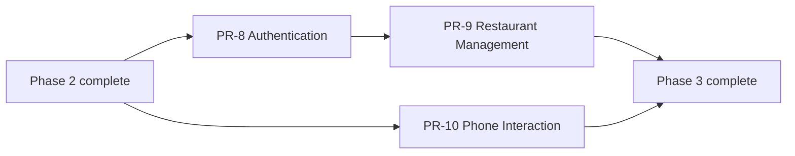

# Phase 3 — Technical Specification

**Status:** Proposed

**Version:** 0.1

**Architecture dependency:** `specifications/architecture.md`

**Product scope:** PR-8 through PR-10

## 1. Purpose

This package converts Phase 3 product requirements into technical specifications for owner authentication, restaurant-information management, automatic publication, and consistent phone interaction.

- `pr-8-authentication.md`
- `pr-9-restaurant-information-management.md`
- `pr-10-phone-interaction.md`
- `backend-operations.md`
- `backend-implementation-evidence.md`

## 2. Scope normalization

1. PR-8 creates first-party owner login/logout using ASP.NET Core Identity and secure same-origin cookie sessions; JWT storage in the browser is not used.
2. Public self-registration is out of scope. MVP owner accounts are provisioned through a controlled administrative/bootstrap process.
3. PR-9 reuses Phase 1 restaurant/schedule/social/media models rather than creating parallel nullable columns.
4. The PRD says saved PR-9 changes publish automatically. Technically, save writes draft and invokes the shared publish pipeline; public projection/cache updates follow the publication target.
5. PR-9's source file is incomplete after Task 2. Tasks 3–14 in its specification are a clearly labelled proposed reconstruction from the PRD and architecture and require product approval.
6. PR-10 consolidates the PhoneLink/CallButton foundation introduced in PR-1 and applies it to existing surfaces only.
7. Search Results, Favorites, and Restaurant Cards are not in the current product scope and are not built by PR-10.

## 3. Delivery order

## 4. Shared administration boundaries

- Admin web routes are under `/admin`; login is `/admin/login`.
- Auth API routes are under `/api/v1/auth`.
- Management API routes are under `/api/v1/admin`.
- Same-origin Front Door routing is required for cookies and antiforgery.
- The authenticated user selects no arbitrary restaurant ID for ordinary owner commands; restaurant context comes from membership.
- Admin endpoints require authentication and feature-specific authorization policies.
- Public and admin DTOs are separate.
- Every mutation validates optimistic concurrency and records an audit event.
- State-changing cookie-authenticated endpoints require antiforgery validation.
- Errors use Problem Details without secrets or existence leaks across restaurants.

## 5. Publication target

For PR-9 automatic publication:

- a successful save transaction updates draft data and creates a publication/outbox request;
- the public API projection becomes current immediately when publication completes;
- web/edge revalidation completes within 60 seconds under normal operation;
- the owner UI shows pending/failed publication rather than claiming success prematurely;
- retry is idempotent;
- media-dependent changes publish only after media processing succeeds.

The 60-second target is an engineering proposal pending product approval of the eventual PR-25 publication guarantee.

## 6. Common definition of done

- all authoritative source tasks and proposed/deferred tasks are labelled and mapped;
- authorization is tested at route, endpoint, and restaurant-resource boundaries;
- cross-restaurant, CSRF, session-expiry, concurrency, and publication-failure cases are tested;
- logs contain no passwords, cookies, tokens, or sensitive request bodies;
- migrations apply cleanly and preserve Phase 1/2 data;
- OpenAPI and browser contracts are reviewed;
- WCAG 2.2 AA and Phase 1 responsive standards pass;
- audit events and operational signals are present;
- manual security and mobile-device checklists are complete.

## 7. Traceability summary

| Product PR | Source tasks | Specification |
| --- | ---: | --- |
| PR-8 Authentication | 10 | `pr-8-authentication.md` |
| PR-9 Restaurant Information Management | 2 authoritative + 12 proposed | `pr-9-restaurant-information-management.md` |
| PR-10 Phone Interaction | 8 | `pr-10-phone-interaction.md` |

## 8. References

- [Application architecture](../architecture.md)
- [Phase 1 specification](../phase-1/README.md)
- [ASP.NET Core Identity](https://learn.microsoft.com/aspnet/core/security/authentication/identity)
