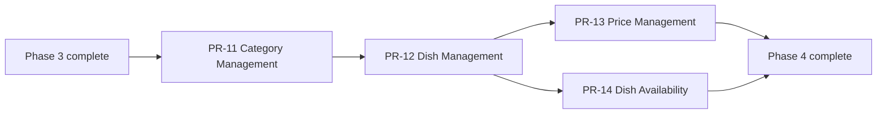

# Phase 4 — Menu Management

**Status:** In implementation

**Version:** 0.1

**Architecture dependency:** `specifications/architecture.md`

**Product scope:** PR-11 through PR-14

## 1. Purpose

This package converts the Phase 4 product requirements into technical specifications for owner-managed menu
categories, dishes, prices, and dish availability.

- `pr-11-category-management.md`
- `pr-12-dish-management.md`
- `pr-13-price-management.md`
- `pr-14-dish-availability.md`
- `implementation-evidence.md`

## 2. Scope normalization

1. Phase 2 already shipped the `menu_categories` and `dishes` tables, the public read model, and the availability
   check constraint. Phase 4 therefore adds owner-facing management on top of the existing schema rather than
   creating parallel tables. PR-11 Tasks 1–2 and PR-12 Task PR12-1 are satisfied by the Phase 2 migrations, and each
   PR adds a migration only where a new column is genuinely required.
2. Requirement documents write routes as `POST /menu/categories`. Per the Phase 3 administration boundary, the
   implemented routes are prefixed with `/api/v1/admin`, so the route is `POST /api/v1/admin/menu/categories`.
3. A category belongs to a restaurant *through its active menu*. The `menu_categories` table carries both
   `restaurant_id` and `menu_id`, and cascade delete from the restaurant is already in place.
4. **Publication model (product ruling).** Phase 4 adapts to the Phase 3 model: every owner save writes the draft and
   invokes the shared publication pipeline automatically. This supersedes PR-14 Tasks 3–5, which describe an explicit
   publish step. Concretely:
   - saving any menu change writes the draft, creates a publication outbox request, and dispatches it;
   - `GET /api/v1/admin/restaurant/preview` continues to render the draft;
   - the public menu reflects the published snapshot, which follows automatically within the Phase 3 publication
     target rather than waiting for a separate owner action.
5. **Unavailable dishes stay visible publicly.** PR-14 Task 6 asks for unavailable dishes to be hidden, which
   contradicts the PRD and the shipped Phase 2 specification (`specifications/phase-2/pr-7-dish-availability.md`
   §113 flagged this conflict and required a product correction before Phase 4). Applying the same "Phase 4 adapts to
   the earlier phase" ruling as item 4, the shipped Phase 2 visitor experience is preserved: unavailable dishes remain
   visible with an explicit indicator, and Phase 4 delivers the owner mutation that Phase 2 deferred.
6. Owner concurrency for every menu mutation reuses the Phase 3 restaurant draft `ETag` / `If-Match` contract, because
   categories and dishes are part of the restaurant draft aggregate that the publication snapshot is built from.
7. Cross-restaurant category and dish identifiers return `404` rather than `403`, per the Phase 3 rule that admin
   errors must not leak the existence of another restaurant's resources.

## 3. Delivery order

## 4. Shared boundaries

- Menu management routes live under `/api/v1/admin/menu`.
- Every route requires the owner policy, and every state-changing route requires antiforgery validation.
- The restaurant context is derived from membership; no request names a restaurant id.
- Mutations run inside one transaction that also writes the publication outbox row and the audit event.
- Validation errors use the shared `admin_validation` problem shape with per-field codes.
- Ordering columns (`menu_categories.display_order`, `dishes.display_order`) carry per-parent unique indexes, so
  reordering stages the new order above the current maximum before writing the final contiguous order.

## 5. Common definition of done

- backend unit tests for validation and integration tests for the owner workflow;
- authorization, antiforgery, concurrency, and cross-restaurant cases tested;
- frontend component tests including accessibility checks;
- `dotnet build`, `npm run lint`, `npm run typecheck`, and both test suites pass;
- OpenAPI contract expectations updated when the route surface changes.

## 6. Traceability summary

| Product PR | Source tasks | Specification |
| --- | ---: | --- |
| PR-11 Category Management | 12 | `pr-11-category-management.md` |
| PR-12 Dish Management | 15 | `pr-12-dish-management.md` |
| PR-13 Price Management | 10 | `pr-13-price-management.md` |
| PR-14 Dish Availability | 9 | `pr-14-dish-availability.md` |

## 7. References

- [Application architecture](../architecture.md)
- [Phase 2 specification](../phase-2/README.md)
- [Phase 3 specification](../phase-3/README.md)
