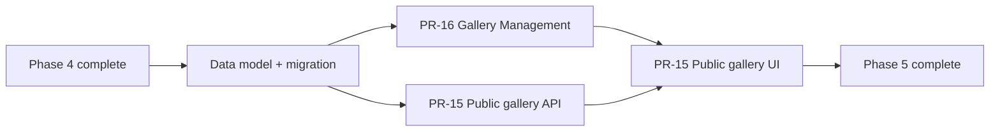

# Phase 5 — Restaurant Gallery

**Status:** Complete. Implemented, reviewed, and verified — the full backend suite passes 201/201 on Linux, and
190/201 on Windows where the remaining 11 are the pre-existing storage-platform limitation in section 6.

**Version:** 0.1

**Architecture dependency:** `specifications/architecture.md`

**Product scope:** PR-15 (Public Gallery) and PR-16 (Gallery Management)

## 1. Purpose

This package converts the Phase 5 product requirements into technical specifications for the visitor-facing
restaurant photo gallery and the owner-facing gallery management surface.

- `pr-15-public-gallery.md`
- `pr-16-gallery-management.md`
- `implementation-evidence.md`

## 2. Scope normalization

PR-15 and PR-16 were written independently and describe the same feature twice, with different field names and a
route shape that does not exist in this system. The following rulings reconcile them. They follow the Phase 4
precedent: **a later phase adapts to the shipped architecture, it does not fork it.**

1. **One entity, not two.** PR-15 Task 1 ("gallery photo": image URL, thumbnail URL, caption, sort order, is active)
   and PR-16 Task 1 (`GalleryImage`: image URL, storage key, display order, width, height, file size) describe the
   same record. Phase 5 ships a single table, `restaurant_gallery_images`, whose columns are the union of both lists.
   `Sort Order` and `Display Order` are the same column, `display_order`.
2. **Storage reuses the Phase 3 media pipeline.** PR-16 Task 3 ("Image Storage Integration") is already satisfied by
   `LocalMediaStorage` and `MediaAssetService`: unique filenames, write-then-persist ordering, and exact-blob
   compensation on persistence failure. Phase 5 does not introduce a second storage abstraction. A gallery image is a
   `media_assets` row (holding alt text) with two `media_variants` rows — the original and a generated thumbnail —
   plus one `restaurant_gallery_images` row carrying gallery membership, caption, order, and active state.
   `Image URL`, `Thumbnail URL`, `Width`, `Height`, `Storage Key`, and `File Size` are therefore variant columns, not
   gallery columns. `media_variants` gains nullable `storage_key` and `file_size_bytes` for this purpose.
3. **Route boundary.** PR-15 Task 2 writes `GET /restaurants/{restaurantId}/gallery`. This platform resolves the
   restaurant from the request host and never names a restaurant id in a route (`specifications/phase-3`,
   `specifications/phase-4` section 2). The implemented public route is `GET /api/v1/public/restaurant/gallery` and
   the owner routes live under `/api/v1/admin/gallery`.
4. **The gallery is part of the restaurant draft aggregate.** Every gallery mutation — including upload — reuses the
   Phase 3 draft `ETag` / `If-Match` contract, runs inside the shared mutation transaction, writes a publication
   outbox row and an audit event, and dispatches publication automatically. This is the Phase 4 section 4 publication
   ruling applied unchanged: there is no separate publish step.
   The standalone `/api/v1/admin/media-assets` upload endpoint stays as it is; it feeds the dish and main-image
   media library and is *not* the gallery upload path.
5. **The public gallery is served from the published snapshot,** not from the draft.
   `GET /api/v1/public/restaurant/gallery` and the `gallery` array on `GET /api/v1/public/restaurant` both project
   the same snapshot, carry the same publication `ETag`, and honour `If-None-Match` with `304`. One source of truth,
   one cache key.
6. **`is_active` is kept; PR-16 does not remove it.** PR-15 Task 1 requires inactive photos to be hidden publicly and
   PR-16 Task 4 requires "exclude unavailable images". These are the same rule. Admin reads return every row;
   public projections return `is_active = true` only. Ordering is maintained across *all* rows so that toggling a
   photo's visibility never renumbers the gallery.
7. **Alt text is required, caption is optional.** PR-15 Task 8 requires alt text for accessibility; PR-15 Task 1
   makes the caption optional. They are different fields with different obligations: alt text lives on the
   `media_assets` row and is mandatory at upload; `caption` lives on the gallery row and may be null. The public
   viewer shows the caption when present and always sets `alt`.
8. **Ordering is 1..N and contiguous.** PR-16 Task 8 is explicit that the first image gets `Display Order = 1`. This
   differs from `menu_categories`, which is 0-based; the gallery follows its own requirement. `(restaurant_id,
   display_order)` is unique, so reorder stages the requested order above the current maximum before writing the
   final contiguous order — the same technique used for category and dish reordering.
9. **Cross-restaurant identifiers return `404`,** never `403`, per the Phase 3 rule that admin errors must not leak
   the existence of another tenant's resources.
10. **"Unlimited photos" is bounded in practice.** PR-15 Task 1 says unlimited; PR-16 Task 7 requires a maximum image
    count. The implemented cap is **50 images per restaurant**, which also bounds the publication snapshot and the
    public restaurant payload. Exceeding it fails upload with `gallery_limit_reached`.

## 3. Delivery order

The data model is shared, so it ships once, ahead of both PRs. PR-16 is built before the public UI because the
public UI needs real gallery rows to render against.

## 4. Shared boundaries

- Owner routes live under `/api/v1/admin/gallery`; the public route is `/api/v1/public/restaurant/gallery`.
- Every owner route requires the owner policy; every state-changing owner route requires antiforgery validation and
  `If-Match` with the current draft `ETag`.
- The restaurant context is derived from membership. No request body or route names a restaurant id.
- Mutations run inside one transaction that also writes the publication outbox row and the audit event
  (`gallery.image.uploaded`, `gallery.image.updated`, `gallery.image.deleted`, `gallery.images.reordered`).
- Validation errors use the shared `admin_validation` problem shape with per-field codes.
- Storage writes happen **before** the transaction and are compensated on failure, exactly as `MediaAssetService`
  does today; storage deletes happen **after** a successful commit so a rolled-back delete never loses a file.

## 5. Common definition of done

- backend unit tests for validation and ordering, integration tests for the owner workflow and the public read;
- authorization, antiforgery, concurrency, cross-restaurant, and limit cases tested;
- frontend component tests including keyboard and accessibility assertions for the viewer;
- `dotnet build`, `npm run lint`, `npm run typecheck`, and both test suites pass;
- OpenAPI contract expectations updated for the new route surface.

## 6. Known platform constraint

`LocalMediaStorage` writes through Unix `libc` P/Invoke and throws `PlatformNotSupportedException` on Windows.
Gallery **upload** therefore cannot be exercised on a native Windows dev machine, while reading and serving gallery
images works. This is a pre-existing Phase 3 limitation, not a Phase 5 regression; it is recorded here because
gallery upload is the first owner workflow whose primary action depends on it. Unit tests must fake
`ILocalMediaStorage` rather than depend on the platform.

## 7. Traceability summary

| Product PR | Source tasks | Specification |
| --- | ---: | --- |
| PR-15 Public Gallery | 10 | `pr-15-public-gallery.md` |
| PR-16 Gallery Management | 10 | `pr-16-gallery-management.md` |

## 8. References

- [Application architecture](../architecture.md)
- [Phase 3 specification](../phase-3/README.md)
- [Phase 4 specification](../phase-4/README.md)
