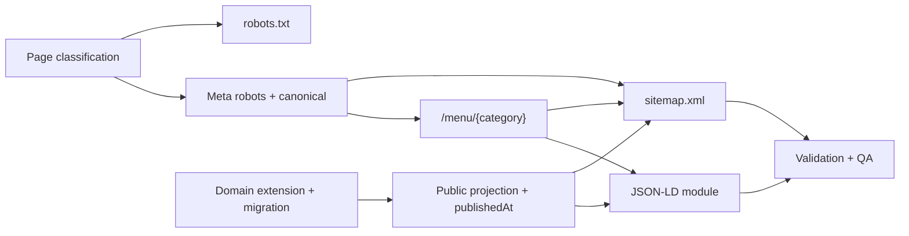

# Phase 6 — Search Engine Indexing, Structured Data, and Searchable Menu

**Status:** Complete. Implemented and verified — see `implementation-evidence.md`. The backend suite passes
**237/237 on Linux**, and 226/237 on Windows where the remaining 11 are the pre-existing media-storage
platform limitation recorded in `specifications/phase-5/README.md` section 6.

**Version:** 0.1

**Architecture dependency:** `specifications/architecture.md`, sections 8, 10, and 16

**Product scope:** PR-17 (Search Engine Indexing), PR-18 (Structured Restaurant Information), PR-19 (Searchable Menu)

## 1. Purpose

This package converts the Phase 6 product requirements into technical specifications for search-engine
indexing control, Schema.org structured data, and an indexable HTML menu.

- `pr-17-search-engine-indexing.md`
- `pr-18-structured-restaurant-information.md`
- `pr-19-searchable-menu.md`
- `page-indexing-classification.md` — the PR-17 Task 1 deliverable
- `implementation-evidence.md`

Architecture section 16 already anticipates this phase. Phase 6 implements it; it does not redefine it.

## 2. Scope normalization

PR-17, PR-18, and PR-19 were written against a generic multi-page restaurant website. This platform is a
host-per-restaurant system with three public routes. The following rulings reconcile the requirements with the
shipped architecture, following the Phase 4 and Phase 5 precedent: **a later phase adapts to the shipped
architecture, it does not fork it.**

1. **Several PR-17 page types do not exist and are classified `N/A`, not `non-indexable`.** PR-17 Task 1 lists
   Registration, Forgot Password, Dashboard, About, Contact, and a standalone Gallery page. This platform
   provisions owners through a controlled backend procedure and never exposes public registration or password
   reset (`specifications/phase-3/backend-operations.md`); the owner portal is `/admin`, not `/dashboard`; and
   the gallery is a section of the home page, not a route. `page-indexing-classification.md` enumerates every
   route that exists and records the absent ones explicitly so the "no ambiguous cases remain" acceptance
   criterion is met by evidence rather than by silence.

2. **`robots.txt` disallows the real paths and keeps the requirement's literal paths as defensive entries.**
   The requirement names `/admin`, `/dashboard`, `/api`, `/login`, and `/register`. Only `/admin` and `/api`
   exist. All five are emitted: the two real ones because they must be blocked, and the three absent ones
   because they cost nothing and pre-block a future route that reintroduces those names. The file is commented
   so the distinction is not lost.

3. **`robots.txt` and `sitemap.xml` are per-host dynamic responses, not build-time static files.** Restaurants
   are resolved from the request host (architecture section 8) and the application has no build-time knowledge
   of which hosts exist. Both documents must therefore be generated per request from the requesting tenant's
   published projection, and the `Sitemap:` line in `robots.txt` must name the requesting host.

4. **The canonical origin is derived from the validated request host, never from a client-controlled value
   alone.** A canonical tag built from an unvalidated `Host` header is a cache-poisoning and SEO-hijacking
   vector. Two existing guards are reused rather than reinvented: `normalizePublicHost` in `lib/menu-api.ts`
   rejects malformed hosts, and the backend resolves the restaurant from the host and returns `404` for an
   unknown one. A canonical URL is therefore only ever emitted for a host that already resolved to a published
   restaurant. The scheme comes from its own deployment-owned `OMNI_REST_PUBLIC_SCHEME`; a client-supplied
   `X-Forwarded-Proto` is never trusted, and `OMNI_REST_FORWARDED_PROTO` is deliberately *not* reused
   because it is set to `https` in local development as a lie to make `Secure` cookies work over HTTP.
5. **Category pages are added; dish pages are not.** PR-17 Task 1 classifies "Dish Page (if it has its own
   URL)" and PR-19 Task 5 requires "Menu URL Integration". Categories already carry a validated, stable slug
   (`menu_categories.slug`, Phase 2 PR-6), so `/menu/{categorySlug}` ships as a real indexable route. Dishes
   carry only a UUID; giving them URLs would require a new slug column, a uniqueness rule, and a backfill, and
   would produce thin pages for one-line dish descriptions. Dishes stay as indexable content within their
   category page. PR-17's "Dish Page" row is therefore classified `N/A — no dedicated URL`, which the
   requirement's own "(if it has its own URL)" qualifier permits.

6. **`/menu` stays the canonical whole-menu URL and keeps its tab behavior.** Architecture section 16 requires
   the menu canonical to stay constant so it can serve as the Phase 9 QR-code target. `/menu` continues to
   server-render every category and dish as HTML, and continues to hide non-selected panels *after* hydration
   (the Phase 2 progressive-enhancement contract, covered by the no-JavaScript e2e test). The indexing risk
   this creates — a JavaScript-executing crawler sees only the selected category as visible — is resolved by
   ruling 5, not by removing the tabs: every category is independently reachable and fully visible at its own
   URL, and every category URL is listed in the sitemap. `/menu` and `/menu/{slug}` are not duplicates; each
   is self-canonical.

7. **PR-18 requires restaurant fields the domain does not have, so the domain is extended.** Restaurant type,
   price range, logo, and cover image have no columns today, and `ck_social_links_platform` restricts platforms
   to `instagram`, `facebook`, `tiktok`, and `google_business` — PR-18 Task 7 also names X, YouTube, and
   LinkedIn. Phase 6 adds the columns, widens the constraint, and extends admin validation and the owner
   editor. These are ordinary restaurant profile fields; modelling them as SEO-only metadata would create a
   second, divergent source of restaurant identity.

8. **Structured data is generated from the published projection, never from the draft.** PR-18 Task 9
   ("Automatic Data Synchronization", "no manual cache clearing") is already satisfied by the Phase 3
   publication pipeline plus `export const dynamic = "force-dynamic"` on the public routes: JSON-LD is
   rendered per request from the same published snapshot the page body reads. No separate schema cache, no
   separate invalidation path, and no possibility of the schema disagreeing with the visible page.

9. **`sitemap.xml` needs a real `lastmod`, and the timestamp already exists — it is simply not surfaced.**
   The public projection carries `publicationVersion`, a monotonic integer, but `lastmod` requires a W3C
   datetime. `publications.published_at` already stores exactly that (`MenuDbContext.ConfigurePublication`),
   so no migration is required: `PublicMenuReader` selects the column it currently drops and the public
   payloads gain a nullable `publishedAt`. Because the value lives on the publication **row** rather than
   inside the serialized snapshot, pre-Phase-6 snapshots need no back-compat defaulting, and the per-version
   memory cache stays correct — `published_at` is invariant for a given version, which is already the cache
   key. Emitting a fabricated or request-time `lastmod` would be worse than omitting the element, and
   omitting it fails the PR-17 Task 3 acceptance criteria.

10. **Query-parameter duplicates are handled by the canonical tag alone. Tracking parameters are not
    redirected.** PR-17 Task 6 asks for canonical URLs, non-indexing of `?ref=` / `?sort=` / `?page=`, and
    "redirects where appropriate". Google's URL-structure and faceted-navigation guidance advises against
    stripping tracking parameters with a `301`: the redirect destroys the campaign attribution that `?ref=`
    exists to carry, and adds a round trip to every campaign click. A `Disallow: /*?` rule in `robots.txt` is
    also rejected — a URL Google cannot crawl is a URL whose canonical tag Google never sees, and with three
    public page types this site has no crawl-budget problem to solve. The self-referencing, parameter-free
    canonical emitted on every public page is therefore the whole mechanism, and it covers unknown future
    parameters for free.

    "Redirects where appropriate" is satisfied by the redirect that *is* appropriate here: trailing-slash
    normalization. Next.js issues a `308` from `/menu/` to `/menu` under the default `trailingSlash: false`,
    which is verified rather than assumed in `implementation-evidence.md`.

11. **JSON-LD is escaped, not merely serialized.** Restaurant name, description, category names, and dish
    text are tenant-supplied and flow directly into a `` sequence inside that data, which is a live XSS vector rather than a theoretical
    one. Every JSON-LD payload is serialized through one shared function that replaces `<` with `<`, per
    the Next.js structured-data guidance. A native `<script>` is used, not `next/script`, because JSON-LD is
    data rather than executable code.

12. **The `404` status is verified, not assumed.** Next.js returns `200` rather than `404` for a `notFound()`
    that is reached *after* the response has begun streaming — which happens when a `loading.tsx` sits above
    the check, or when the check runs inside a `Suspense` boundary. This application currently has no
    `loading.tsx` and performs its existence checks before any suspending boundary, so `notFound()` produces a
    real `404`. Because PR-17 Task 7 forbids soft `404`s outright, that behavior is pinned by an end-to-end
    status-code assertion rather than left to survive an unrelated future change. Introducing a `loading.tsx`
    above a public route is, from Phase 6 onward, an SEO-breaking change.

## 3. Delivery order

The page classification is the PR-17 Task 1 dependency for everything in PR-17. The domain extension ships
early because both the sitemap (`publishedAt`) and the JSON-LD (identity fields) read from the widened public
projection.

## 4. Shared boundaries

- New public route: `/menu/{categorySlug}`. New generated documents: `/robots.txt`, `/sitemap.xml`.
- No new public API route. The existing `GET /api/v1/public/restaurant` and `GET /api/v1/public/menu` payloads
  are widened; both remain host-resolved and snapshot-backed.
- New owner routes mirror the existing main-image contract: `/api/v1/admin/restaurant/logo` and
  `/api/v1/admin/restaurant/cover-image`, each requiring the owner policy, antiforgery, and `If-Match`.
- Restaurant profile fields are part of the restaurant draft aggregate and publish through the existing
  outbox, exactly as Phase 5 ruling 4 established for the gallery. There is no separate publish step.
- Canonical, meta robots, and JSON-LD are emitted only by public routes. Every `/admin` route stays
  `noindex, nofollow`.

## 5. Common definition of done

- backend unit tests for the new validation and projection rules, integration tests for the new owner routes
  and the widened public reads;
- frontend tests for the origin resolver, the JSON-LD builder (including the empty-property and absent-data
  cases), the sitemap and robots documents, and the category route;
- e2e coverage for `robots.txt`, `sitemap.xml`, canonical tags, meta robots, and the `404` status;
- `dotnet build`, `dotnet format --verify-no-changes`, `npm run lint`, `npm run typecheck`, and both test
  suites pass;
- OpenAPI contract expectations updated for the new owner route surface.

## 6. Traceability summary

| Product PR | Source tasks | Specification |
| --- | ---: | --- |
| PR-17 Search Engine Indexing | 8 | `pr-17-search-engine-indexing.md` |
| PR-18 Structured Restaurant Information | 10 | `pr-18-structured-restaurant-information.md` |
| PR-19 Searchable Menu | 12 | `pr-19-searchable-menu.md` |

## 7. References

- [Application architecture](../architecture.md)
- [Phase 3 specification](../phase-3/README.md)
- [Phase 5 specification](../phase-5/README.md)
